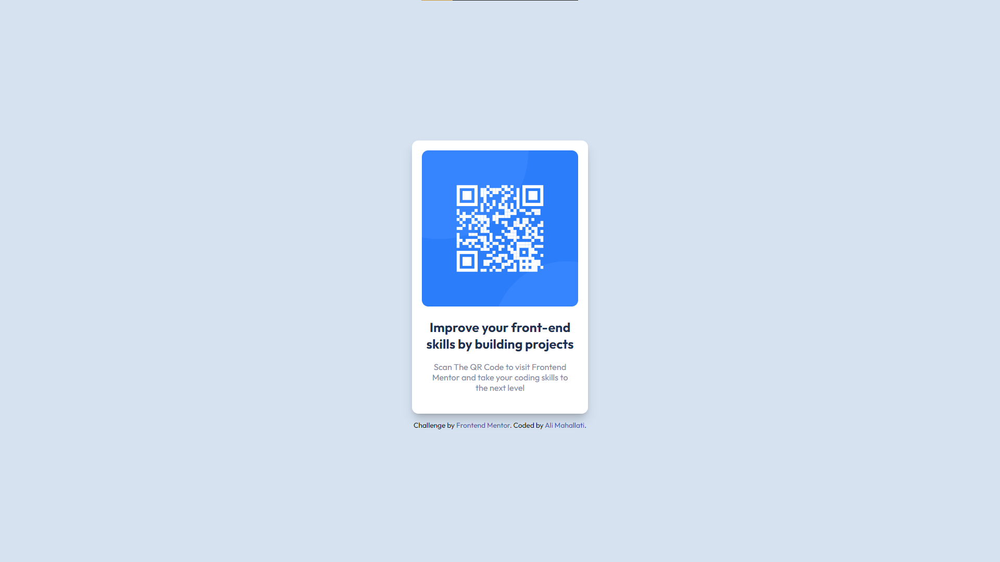

# Frontend Mentor - QR code component solution

This is a solution to the [QR code component challenge on Frontend Mentor](https://www.frontendmentor.io/challenges/qr-code-component-iux_sIO_H). Frontend Mentor challenges help you improve your coding skills by building realistic projects.

## Table of contents

- [Overview](#overview)
  - [Screenshot](#screenshot)
- [My process](#my-process)
  - [Built with](#built-with)
  - [What I learned](#what-i-learned)
  - [Useful resources](#useful-resources)
- [Author](#author)

## Overview

### Screenshot

## My process

### Built with

- Semantic HTML5 markup
- CSS custom properties
- Flexbox

### What I learned

this project improved my designing skills

### Useful resources

- [Example resource 1](https://tailwindcss.com/docs/box-shadow) - This helped me for Box Shadow. I really liked this pattern and will use it going forward.

## Author

- Frontend Mentor - [@Ali28202](https://www.frontendmentor.io/profile/Ali28202)
- Github - [@Ali28202](https://github.com/Ali28202)
